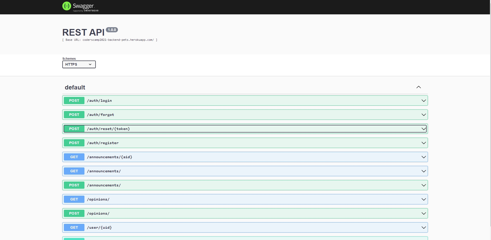

# CodersCamp 2021 - Project Server Side JavaScript - PetsAdoptAndCarePortal

## Project goals
The aim of the project was to gain practical skills in Node.js, creating REST APIs, handling NoSQL databases and CRUD operations, and user authentication and authorization

## Team behind the project

### Mentor:

- [Jędrzej Ratajczak](https://github.com/Nilphym)

### Contributors:

- [Dawid Starzyk](https://github.com/JustD1d1t)
- [Dawid Żłobecki](https://github.com/DawidZlobecki)
- [Krzysztof Gumularz](https://github.com/KrisGum)
- [Przemysław Gajowczyk](https://github.com/Przemyslaw-G)
- [Marcin Kukułka](https://github.com/MarcinKukulka)

## Backend service description

### How to run the backend

1. You can clone the repository, install the dependencies with `npm install` and run the app with `npm run start`
   

2. You can also just use the production version of the application available at [https://coderscamp2021-backend-pets.herokuapp.com/doc](https://coderscamp2021-backend-pets.herokuapp.com/doc)

For both options be aware that you have to

1. Create your own account using `/api/register` endpoint
2. Log in using `/api/login` endpoint
3. Then you will be able to access the user endpoints

### Endpoint documentation

All endpoints with sample requests are described in [Swagger](https://coderscamp2021-backend-pets.herokuapp.com/doc/)

### Backend functionalities

At this step all you have to do is create file .env based on .env.example

- **.env** file is a source of environment variables for this application

- **PORT** - on which server will start

- **JWT_SECRET** - defines a compact and self-contained way for securely transmitting 
information between parties as a JSON object.

- **DB_URL** - to connect to MongoDB database

- **User management/Authorization** - Users are being authorized using the token sent in each request header that has to match the token from the response sent after login.
- **Password management** - Password is being hashed during the registration and is safely stored in the database in hashed form.
- **Password reset** - When password reset is requested then email with password reset link is sent with authentication token added as URL parameter.

### Used technologies

- **Node.JS** - Javascript runtime for building server-side JS applications
- **Express** - Node.JS framework
- **MongoDB** - Document database for data storage - in our project cloud MongoDB Atlas service was used
- **Mongoose** - Data Modelling Library for MongoDB
- **Nodemailer** - Mailing library
- **JsonWebToken** - Tokenization method for users authentication
- **BCrypt** - Password hashing library for password management
- **Heroku** - Platform-as-a-Service used for application deployment

### Api folder content

- **App** folder - source code for the backend application
  - **Controllers** - functionalities for directly responding to user actions
  - **DB** - folder - code for connecting to database and models
    - **Models** - data models
    - **Mongoose** - connecting db
    - **Validators** - validation of requests
  - **Middlewares** - functions for request data manipulations before executing root functionalities
  - **Routes** - endpoint routes definitions
- index.js - main application instantiation
